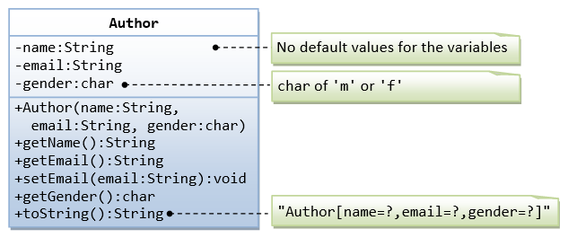
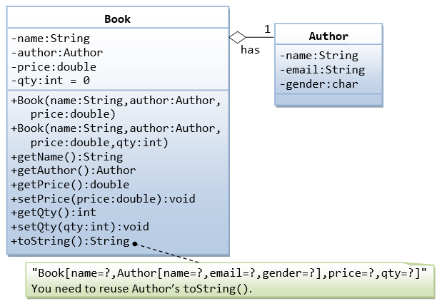
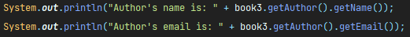
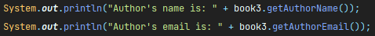

# Encapsulation - Books and Authors

In this exercise, we'll be visiting encapsulation, along with composition. We'll be creating a few
classes as described below:

> **Hint:** Composition is the term used for a **HAS-A relationship** between classes.
---

## Author Class

Take a look at the Author class's diagram:

You should write the Author class as shown in the class diagram. The class is designed to model a
book's author. it contains:

1. **Three private instance variables**: `name` (String), `email` (String), and `gender` (char of
   either 'm' or 'f').;

> **Bonus:** Make `gender` an **enum** instead, for type safety, and add non-binary gender
> values as you will.

2. **One constructor** to initialize the name, email and gender with the given
   values `public Author (String name, String email, char gender) {......}`

> **Hint:** (There is no default constructor for Author, as there are no defaults for name, email and
> gender).

3. **public** getters/setters: `getName()`, `getEmail()`, `setEmail()`, and `getGender()`;

> **Hint:** (There are no **setters** for **name** and **gender**, as these attributes cannot be
> changed). Thus, you can also mark them **final**.

4. A `toString()` method that returns **Author[name=?,email=?,gender=?]**, e.g., `Author
   [name=Aloe Vera, email=isthisanemail@somewhere.com,gender=m]`.

> **Hint:** You can use your IDE's **toString() generator** to help you to write the `toString()` method.
---

## Book Class

Take a look at the Book class's diagram:

You should write the Book class as shown in the class diagram. The class is designed to model a book
written by an author. it contains:

1. **Four private instance variables**: `name` (String), `author` (of the class Author you have just
   created), `price` (double), and `qty` (int);

2. Two constructors:

`public Book (String name, Author author, double price) { ...... }`\
`public Book (String name, Author author, double price, int qty) { ...... }`

> **Hint:** Don't duplicate code! Make sure your second constructor **calls** the first one
> (using the `this` keyword), passing
> the parameters on and doing its specific setups afterwards!

3. **public methods** `getName()`, `getAuthor()`, `getPrice()`, `setPrice()`, `getQty()`, `setQty()`
   .

4. A `toString()` that returns `Book[name=?,Author[name=?,email=?,gender=?],price=?,qty=?`. You
   should **reuse** Author’s `toString()` here.

> **Hint:** Take note that **both** **Book** and **Author** classes have a variable called `name`. However, it
> can be differentiated via the referencing instance. For a Book instance, say `aBook`, `aBook.name`
> refers to the name of the book; whereas for an Author's instance, say `auAuthor`, `anAuthor.name`
> refers to the name of the author. **There is no need (and it's not recommended)** to call the
> variables `bookName` and `authorName`.

---

## BookTest Class

Now that both our Author and Book classes are created, it's time to use them!

Head to the BookTest class. This class contains our **main method**.

Create a few instances of the Author class. They'll be printed on the console once you run the main
method.

In one of the instances, we'll call the setEmail() method to change the value of the email, and then
we'll print it again. See how the value of the email changes?

You should see a result similar to this:

Now you should also create books instances. Create a few of them and associate the previously
created authors to them.

In one of the instances, we'll be changing the price and the quantity through their respective
setter methods. You can see how the changes will be stored in the object instance.

You should get a result similar to this:

---

## Results

With this, you can see how we achieved encapsulation. We aggregated states (fields) and behaviors (
methods) together in a single place: a class. You can see that each class created is responsible to
manage its state, and no one else but itself, through its methods. With encapsulation, we can make
sure that no other class can modify the state of a class, and outside classes can only do what a
given class allows it to do.

> ## Extra:
> Now that you understand encapsulation a bit more, go back to our BookTest class and spot the
> following lines of code:
>
> 
>
> You see how we get the author's name and email? We have to navigate to the author's instance
> that linked to the book and then retrieve them. Now, reflect about this:
>
> #### Does it make sense that the Book class can retrieve those values directly?
> The answer is: **depends!** On what? On our requirements. Make the next question:
> #### Is this a field (name, email) that is commonly requested from outside classes that are using the Book class?
> If the answer is **yes**, then it probably makes sense.
>
> Then, with no further due, you can put create new methods in the Book class and move
> these lines to it. Then it should look like this:
>
> 
>
> By doing this, we're adding more functionality to the Book class - one that is **within its
> scope** - to retrieve its own author's name and email.