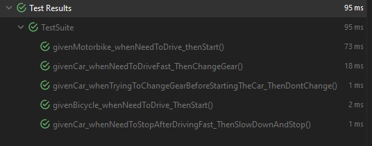

# Java - OOP in Practice - Vehicles

Time to put our knowledge of abstract classes and interfaces into practice! 

You'll be given some classes and interfaces. Implement what's asked below until every test in our **_TestSuite_** 
class are passing!

### Overview of Vehicle.java:
- This is our interface. It defines a contract/blueprint of what a vehicle is.
- The Vehicle contract should define the following methods:
  - **_start()_**: defines that a vehicle should be able to start;
  - **_stop()_**: defines that a vehicle should be able to stop;
  - **_drive()_**: defines that a vehicle should be able to drive;
  - **_changeGear()_**: defines that a vehicle should be able to change gear.
- For the purpose of this exercise, all the above mentioned methods should return a **_String_**, so it should be 
  specified in our Vehicle blueprint.

### Overview of Bicycle.java:
- The **_Bicycle_** class is our first concrete implementation of our **_Vehicle_** interface! Since it's 
  implementing the interface directly, it should provide implementations of every method defined in our blueprint.

- **_start()_**: Implemented from the **_Vehicle_** interface.
  - **_Returns_**:
    - It should simply return `"Starting to bike!"`.

- **_stop()_**: Implemented from the **_Vehicle_** interface.
  - **_Returns_**:
    - It should simply return `"Stopping the bike!"`.

- **_drive()_**: Implemented from the **_Vehicle_** interface.
  - **_Returns_**:
    - It should simply return `"Biking around!"`.

- **_changeGear()_**: Implemented from the **_Vehicle_** interface.
  - **_Returns_**:
    - It should simply return `"This bike only has one gear, so cannot change it."`.

### Overview of AbstractEngineVehicle.java:
- This is an abstract class that implements our **_Vehicle_** interface. It implements a few common behaviors 
  between every vehicle with an engine, but it also defines new abstract methods that should be implemented by any 
  class that extends it.
- This abstract class holds logic common to every vehicle that has an engine.
  - It has a **final int** field called **_numberOfGears_**. This field represents the total number of gears a given 
    vehicle with engine has. This value is received in its **constructor**, which is passed by every class that 
    implements it.
  - It has an **int** field called **_currentGear_**, which holds information of the current gear. This field 
    should start as 0 (and should always be 0 as long as the vehicle is off), and cannot bypass the 
    **_numberOfGears_** field.
  - It has a **boolean** field called **_gearShouldIncrease_**, which is a flag that represents if the gear should 
    increase or decrease. It should start as _true_. More on that later on.
  - It has a **boolean** field called **_isOn_**, which is a flag that says if the vehicle is on or not. It should 
    start as _false_.
    

- **_start()_**: This method is implemented from the **_Vehicle_** interface. It should do logic common to every 
    engine vehicle:
    - It should set the **isOn** flag to _true_;
    - It should change the make a call to the **_changeGear()_** method, so the gear changes from 0 to 1;
    - **_Returns_**: 
      - It should return a call to the implementation specific method, **_doStart()_**.

- **_stop()_**: This method is implemented from the **_Vehicle_** interface. It should do logic common to every
  engine vehicle:
  - It should set the **isOn** flag to _false_;
  - It should change the **currentGear** to 0;
  - **_Returns_**: 
    - It should return a call to the implementation specific method, **_doStop()_**.
  

- **_changeGear()_**: This method is implemented from the **_Vehicle_** interface. It should do logic common to every
  engine vehicle:
  - For the sake of our exercise, the **_changeGear()_** method should work in an increasing/decreasing way.
  - Whenever **gearShouldIncrease** is _true_, **_changeGear()_** should _increase_ **currentGear** by one.
  - Whenever **gearShouldIncrease** is _false_, **_changeGear()_** should _decrease_ **currentGear** by one.
  - If we hit the highest gear, then the gear should start to go down. So whenever **currentGear** is equals to 
    **numberOfGears**, then **gearShouldIncrease** should be set to _false_.
  - The same way, if we reach the lowest gear (1), or if the vehicle was not started at all (currentGear = 0), then the 
    gear should start to come up. So whenever **currentGear** is less than or equals to 1, **gearShouldIncrease** 
    should be set to _true_.
  - **_Returns_**:
    - Before any of above mentioned logics, we need to check if the vehicle engine is on, by checking the **isOn** flag.
    - If the vehicle engine is **NOT** on, none of the above logic should be executed, and instead it should return the 
    following message: `"You need to turn the vehicle on first."`
    - If the vehicle engine is on, then we execute the logic, and by the end, you should return a message specifying 
    from which gear to which gear it changed, in the following format: `"Changed from gear [X] to [Y]."`, where 
    **X** and **Y** represents the original value before changing the gear and the new value, respectively. An 
    example could be: `"Changed from gear [4] to [5]."`.
      

- **_doStart()_**: This is an abstract method from the **_AbstractEngineVehicle_** class. It executes implementation 
  specific actions that classes that extends from this class should do when the **_start()_** method is called. More 
  on that later.
  

- **_doStop()_**: This is an abstract method from the **_AbstractEngineVehicle_** class. It executes implementation
  specific actions that classes that extends from this class should do when the **_stop()_** method is called. More
  on that later.
  
### Overview of Car.java:
- The **_Car_** class is a concrete implementation of the abstract class **_AbstractEngineVehicle_**, as well as a 
  concrete implementation of the **_Vehicle_** interface, since **_AbstractEngineVehicle_** implements it. In this 
  context, we can say that a **_Car_** IS-A **_AbstractEngineVehicle_** as well as a **_Car_** IS-A **_Vehicle_**.
- It has a **final String** field called _model_. This field defines the model of the Car, and is received in its 
  constructor.
- In our exercise, every Car has **5 gears**. Meaning that we don't need to receive the number of gears in its 
  constructor, but instead we need to send _5_ to the **super** (AbstractEngineVehicle) constructor.
  

- **_doStart()_**: This is the implementation specific logic of the **_start()_** method from its superclass. 
  Anytime the **_start()_** from a **_Vehicle_** or **_AbstractEngineVehicle_** reference is called, then the 
  **_start()_** should be executed (implemented in the **_AbstractEngineVehicle_**), and according to our 
  implementation, by the end it should return a call to our **_doStart()_** method.
  - **Returns**: 
    - We're not going fancy, so it should simply return `"Starting the " + model;`. So, if the model is **BMW**, the 
      returned value should be `"Starting the BMW"`.
      

- **_doStop()_**: This is the implementation specific logic of the **_stop()_** method from its superclass. All the 
  rules that applies to the **_doStart()_** also apply to this one, except this is linked to the **_stop()_** method.
  - **Returns**:
    - We're not going fancy, so it should simply return `"Stopping the " + model;`. So, if the model is **Mercedes**,
      the returned value should be `"Stopping the Mercedes"`.
      

- **_drive()_**: This method is defined in our **_Vehicle_** interface, but in our exercise every concrete 
  implementation should have its own logic, and they don't share any behavior. This is the reason this method was 
  not implemented in the abstract class **_AbstractEngineVehicle_**, but instead left to the concrete 
  implementations like our **_Car_** class.
  - Returns:
    - Without going fancy, the **_Car_**'s implementation of **_drive()_** should simply return `"Driving a " + 
      model;`. So, if our model is **Golf**, the return value should be `"Driving a Golf"`.

### Overview of Motorbike.java:
- The **_Motorbike_** class is our second concrete class that implements our abstract class 
  **_AbstractEngineVehicle_**.
- Unlike our **_Car_** implementation, the **_Motorbike_** doesn't have a _model_ field, meaning it only has the 
  default constructor. Since our **_AbstractEngineVehicle_** abstract class doesn't have a default constructor, we 
  need to make a call to the **super()**, providing the **numberOfGears**. In our exercise, every motorbike should 
  have **6** gears.
  

- **_doStart()_**: Implementation specific for our **_Motorbike_** class.
  - **Returns**:
    - We're not going fancy, so it should simply return `"Starting the motorbike"`.

- **_doStop()_**: Implementation specific for our **_Motorbike_** class.
  - **Returns**:
    - We're not going fancy, so it should simply return `"Stopping the motorbike"`.

- **_drive()_**: Implementation specific for our **_Motorbike_** class.
  - **Returns**:
    - We're not going fancy, so it should simply return `"Driving the motorbike"`.

### Overview of TestSuite.java:
- The **_TestSuite_** class contains all the tests that we need to work. Before implementing what's needed, this
  class might be giving you compile errors.
- As you implement what's necessary for the tests to pass, this class should give you no more compile errors, but
  still fail to pass one or more tests until you implement everything that's needed.
- To run the tests, open the class in your editor and click the _Run Test_ button next to the class' name.
- **_DO NOT MODIFY THIS FILE!_** The tests are written as they should be, so your focus should be on the
  implementation of the classes until the tests are passing.
  
When all the tests are passing, you should have an output similar to the one below:

